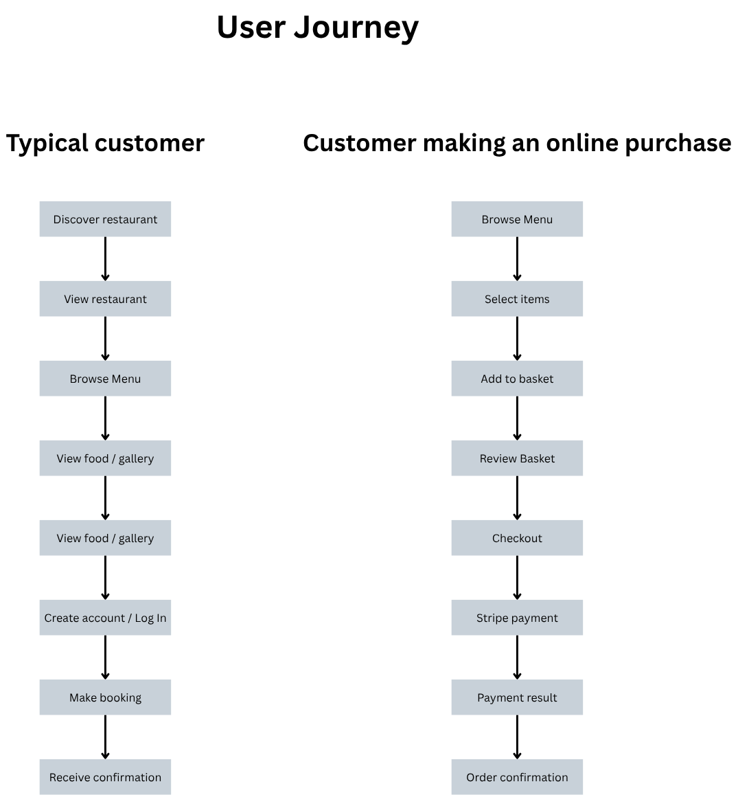

# Flavour Bistro

## Content

1. [Project Overiew](#project-overview)
    1. [Project Introduction](#project-introduction)
    2. [Project Rationale](#project-rationale)
    3. [Project Purpose](#project-purpose)
    4. [Target Audience](#target-audience)
    5. [Value Proposition](#value-proposition)
    6. [Project Goals](#project-goals)

2. [User Experience (UX)](#user-experience-ux)
    1. [User Research](#user-research)
    2. [User Personas](#user-personas)
    3. [User stories](#user-stories)
    4. [User Requirements](#user-requirements)
    5. [UX Design Principles](#ux-design-principles)
    6. [Navigation Structure](#navigation-structure)
    7. [User Journey](#user-journey)
    8. [Accesibility](#accesibility)
    9. [Responsive Design](#responsive-design)

3. [Design Process](#design-process)
    1. [Design Concept](#design-concept)
    2. [Colour Scheme](#colour-scheme)
    3. [Typography](#typography)
    4. [Imagery and Visual Identity](#imagery-and-visual-identity)
    5. [WireFrames](#wireframes)
    6. [Design Decisions](#design-decisions)
    7. [Design Iterations](#design-iterations)

4. [Features](#features)
    1. [Public Features](#public-features)
    2. [User Features](#user-features)
    3. [Authentication Features](#authentication-features)
    4. [Booking Features](#booking-features)
    5. [Shopping basket](#shopping-basket)
    6. [Checkout and Payment](#checkout-and-payment)
    7. [Administrator Features](#administrator-features)
    8. [User Feedback](#user-feedback)
    9. [Error Handling](#error-handling)
    10. [Data Management and CRUD](#data-management-and-crud)

5. [Technologies and Tools](#technologies-and-tools)
    1. [Front-end Technologies](#front-end-technologies)
    2. [Back-end Technologies](#back-end-technologies)
    3. [Database](#database)
    4. [Third-party Services and APIs](#third-party-services-and-apis)
    5. [Development Tools](#development-tools)
    6. [Testing Tools](#testing-tools)
    7. [Version Control](#version-control)

6. [Project Apps](#project-apps)

## Project Overview

### Project Introduction

Flavour Fusion Restaurant is a full-stack web application designed for a fictional modern restaurant based in Cardiff, Wales. The application provides customers with an accessible and engaging way to discover the restaurant, explore its menu, view its food and venue, make table bookings and, ultimately, purchase items through an integrated online ordering and payment system.

The project has been developed with a real-world restaurant scenario in mind. Rather than functioning solely as a static promotional website, the application is designed to provide an interactive digital service for both customers and restaurant staff.

### Project Rationale

The project is not intended as a production-ready restaurant website, but rather as an educational example that helps learners understand:

* How to set up and configure a Django project.
* How to create apps, models, views, and templates (Application architecture).
* How to work with forms, authentication, and static/media files.
* How to structure a project using best practices.
* How to integrate a payment process.
* How a real-world use case (a restaurant site with menus, reservations, and opening times) can be implemented in Django.

The overall objective is to create an application that is both visually appealing and functionally useful, while maintaining appropriate accessibility, security and usability standards.

### Project Purpose

The primary purpose of Flavour Fusion Restaurant is to provide customers with a central online platform through which they can interact with the restaurant.

The application is intended to allow users to:

* Discover the restaurant and its concept.
* Browse the available menu.
* View food and restaurant photography.
* Find location and contact information.
* Create an account.
* Make and manage table bookings.
* Browse available products.
* Add items to a shopping basket.
* Complete secure online payments.
* Receive clear feedback about their actions.

The application also provides restaurant staff with functionality to manage relevant business data securely.

The project has therefore been designed around two related audiences: restaurant customers and restaurant administrators.

### Target Audience

#### Primary Audience: Restaurant Customers

The primary audience consists of people looking for a restaurant in Cardiff and the surrounding area.

This audience may include:

* Local residents.
* Couples looking for a dining experience.
* Groups of friends.
* Families.
* Visitors to Cardiff.
* Customers interested in trying new cuisine.

These users are likely to access the application using a mixture of desktop computers, tablets and mobile phones.

#### Secondary Audience: Restaurant Staff and Administrators

The secondary audience consists of restaurant staff responsible for managing the application.

Administrators require secure access to functionality that should not be available to ordinary customers, such as:

* Managing menu items.
* Managing categories.
* Reviewing bookings.
* Updating booking status.
* Managing customer-related information where appropriate.

### Value Proposition

Flavour Fusion provides value by bringing restaurant discovery, customer interaction and transactional functionality together within a single application.

For customers, the application reduces the need to use multiple channels to obtain information or interact with the restaurant. Users can move from discovering the restaurant to viewing its menu, making a booking and completing a purchase through a consistent interface.

For restaurant staff, the application provides a structured way of managing business information and customer interactions.

### Project Goals

The main goals of the project are:

* To create a professional and responsive restaurant web application.
* To provide an intuitive and accessible user experience.
* To clearly communicate the restaurant's identity and offering.
* To provide customers with useful restaurant and menu information.
* To allow authenticated customers to create and manage bookings.
* To provide complete CRUD functionality for relevant application data.
* To implement secure authentication and authorisation.
* To provide an online payment facility using a recognised payment provider.
* To protect customer and application data through appropriate security practices.
* To thoroughly test the application before deployment.
* To deploy the finished application to a cloud hosting platform.
* To produce a maintainable and scalable Django application following framework conventions.

## User Experience (UX)

### User Research

The initial design process considered the typical requirements of customers interacting with a modern restaurant website.

The research focused on identifying the information and functionality that users are most likely to expect when visiting a restaurant website, including:

* Restaurant identity and atmosphere.
* Menu information.
* Food imagery.
* Pricing.
* Location.
* Opening information.
* Contact details.
* Booking functionality.
* Online purchasing.
* Confirmation and feedback.

### User Personas

The design is centred around two principal user groups.

#### Persona 1: The customer

**Name:** Sophie  
**Age:** 28  
**Occupation:** Marketing Executive  
**Location:** Cardiff  

Sophie enjoys eating out and often discovers restaurants through their websites and social media profiles. She normally uses her mobile phone when researching restaurants.

Her main requirements are:

* Quickly understanding what the restaurant offers.
* Viewing the menu before visiting.
* Checking prices.
* Viewing photographs of the food.
* Finding the restaurant location.
* Making a booking without having to telephone the restaurant.

Sophie values a visually attractive website, but she prioritises ease of navigation and clear information.

#### Persona 2: The restaurant Administrator

**Name:** James  
**Age:** 41  
**Occupation:** Restaurant Manager  
**Location:** Cardiff

James is responsible for managing the day-to-day operation of the restaurant.

He requires an administrative interface that allows him to:

* Manage menu information.
* Review customer bookings.
* Update booking statuses.
* Keep restaurant information accurate.
* Access customer information only where appropriate.

James is less concerned with visual browsing and more concerned with efficiency, security and reliability.

### User stories

User stories were developed during the planning stage of the project to identify the requirements of the application's different user types.

The existing user stories are used as a foundation for the application's feature set and development priorities.

The stories are organised around the main user roles:

* Customer. The customer stories focus primarily on discovering the restaurant, browsing its content, managing bookings and completing purchases.
* Restaurant administrator. The administrator stories focus on managing application data and supporting the restaurant's day-to-day operations.

The complete user story documentation is included within the project's design documentation. [User Stories](documentation/user_experience/user_stories/user_stories.xlsx)

### User Requirements

The user stories were translated into a set of functional and non-functional requirements.

The complete user requirements documentation is included within the project's design documentation. [User Requirements](documentation/user_experience/user_requirements/requirements.md)

### UX Design Principles

The application has been designed around several established UX principles.

* #### Clarity

Important information should be immediately understandable. The homepage therefore communicates the restaurant's identity and purpose without requiring users to navigate through multiple pages.

* #### Simplicity

The number of navigation options is intentionally limited so that users can easily identify the main areas of the website.

* #### Consistency

Common components such as the navigation menu, page structure, buttons, typography and footer should remain visually and behaviourally consistent throughout the application.

* #### User Control

Users should remain in control of their actions. The application should avoid unexpected navigation, aggressive pop-ups or automatic media playback.

Actions that could result in data changes should provide appropriate confirmation or feedback.

* #### Feedback

Users should be informed when an action has succeeded or failed, such as *successsful booking messages* and *Payment confirmation*.

* #### Error Prevention

The interface should prevent avoidable errors wherever possible through appropriate validation, clear labels and sensible input controls.

### Navigation Structure

The main navigation provides access to the most important areas of the application.

The navigation is designed to remain consistent across pages so that users do not have to learn a different interface when moving between sections.

The primary navigation includes:

* Home.
* Menu.
* Gallery.
* Contact.
* Account/Login.
* Booking functionality where appropriate.

Authenticated users are presented with additional options relevant to their account.

Administrative functionality is not exposed as part of the normal customer navigation.

On smaller screens, the navigation adapts to the available space while retaining access to the same core functionality.

### User Journey

The design aims to minimise unnecessary steps while ensuring that users receive sufficient information before committing to an action.

### Accesibility

Accessibility is considered throughout the design rather than being treated as a final development stage.

The application aims to follow recognised accessibility principles, including:

* Semantic HTML.
* Meaningful page headings.
* Clear form labels.
* Descriptive alternative text for meaningful images.
* Sufficient colour contrast.
* Keyboard-accessible interactions.
* Clearly identifiable interactive elements.
* Visible focus states.
* Appropriate error messages.
* Logical tab order.
* Responsive layouts.
* Avoidance of unnecessary animation or automatic media playback.

Accessibility testing will be carried out during development using both automated tools and manual checks.

### Responsive Design

The application is designed using a mobile-first approach where appropriate, recognising that restaurant customers are likely to access the website from mobile devices.

The layout adapts to different viewport sizes while maintaining the same information hierarchy and core functionality.

The final application will be tested across desktop, tablet and mobile viewport sizes to ensure that functionality remains accessible and usable.

## Design Process

### Design Concept

The visual concept for Flavour Fusion Restaurant is based on the idea of combining a contemporary restaurant identity with a warm and inviting dining experience.

The design uses high-quality food photography as an important part of the visual identity. Images are intended to communicate the quality and presentation of the restaurant's food while helping users understand the atmosphere of the business.

The interface aims to balance visual impact with usability, ensuring that decorative elements do not interfere with the customer's ability to find important information.

### Colour Scheme

The colour palette was selected to support the restaurant's visual identity and create a sophisticated dining atmosphere.

The design uses a restrained combination of colours so that the interface remains visually consistent across different pages.

Colour is used to establish:

* Visual hierarchy.
* Contrast between sections.
* Navigation states.
* Interactive elements.
* Calls to action.

Colour is not intended to be the sole method of communicating important information, supporting accessibility for users who may have difficulty distinguishing certain colours.

### Typography

Typography was selected to provide a balance between visual character and readability.

Headings are used to establish a clear information hierarchy, while body text is kept sufficiently readable for longer content such as menu descriptions and booking information.

Typography is applied consistently across the application to reinforce the restaurant's visual identity.

Font sizes and spacing are adjusted through responsive CSS so that text remains readable on smaller screens.

| Level | Font-family | Font-size | Weight |
| --- | --- | --- | --- |
| Brand | [`Italianno`](https://fonts.google.com/specimen/Italianno?query=Italianno&preview.script=Latn) | 40px–52px | 400 |
| H1 | [`Playfair Display`](https://fonts.google.com/specimen/Playfair+Display) | 42px–52px | 700 |
| H2 | [`Playfair Display`](https://fonts.google.com/specimen/Playfair+Display) | 32px–38px | 600 |
| H3 | [`Playfair Display`](https://fonts.google.com/specimen/Playfair+Display) | 24px–28px | 600 |
| Menu item | [`Playfair Display`](https://fonts.google.com/specimen/Playfair+Display) | 20px–24px | 600 |
| Body | [`Lato`](https://fonts.google.com/specimen/Lato?preview.script=Latn) | 16px–18px | 400 |
| Body emphasis | [`Lato`](https://fonts.google.com/specimen/Lato?preview.script=Latn) | 16px–18px | 700 |
| Navigation | [`Lato`](https://fonts.google.com/specimen/Lato?preview.script=Latn) | 16px | 600 |
| Button | [`Lato`](https://fonts.google.com/specimen/Lato?preview.script=Latn) | 15px–16px | 700 |
| Form label | [`Lato`](https://fonts.google.com/specimen/Lato?preview.script=Latn) | 15px–16px | 700 |
| Input | [`Lato`](https://fonts.google.com/specimen/Lato?preview.script=Latn) | 16px | 400 |
| Small text | [`Lato`](https://fonts.google.com/specimen/Lato?preview.script=Latn) | 14px | 400 |
| Footer heading | [`Playfair Display`](https://fonts.google.com/specimen/Playfair+Display) | 20px–24px | 600 |
| Footer text | [`Lato`](https://fonts.google.com/specimen/Lato?preview.script=Latn) | 14px–16px | 400 |
| Error | [`Lato`](https://fonts.google.com/specimen/Lato?preview.script=Latn) | 14px–16px | 600 |
| Success | [`Lato`](https://fonts.google.com/specimen/Lato?preview.script=Latn) | 14px–16px | 600 |

### Imagery and Visual Identity

Photography is an important part of the Flavour Fusion brand.

Food imagery is used to:

* Showcase menu items.
* Create visual interest.
* Communicate food quality.
* Support the restaurant's premium positioning.
* Help users understand the dining experience.

Images are organised into appropriate sections rather than being used indiscriminately.

The gallery provides a dedicated area for users who want to explore the restaurant visually, while relevant images are also used to support content elsewhere in the application.

Alternative text will be provided for meaningful images to support accessibility.

### WireFrames

Wireframes were produced during the planning stage before the final interface was implemented.

The existing wireframes establish the basic layout and information hierarchy for the main pages.

The documented wireframes include designs for:

* Home page.
* Menu page.
* Gallery page.
* Contact page.

The wireframes were used to consider:

* Placement of the navigation.
* Hero content.
* Information hierarchy.
* Menu presentation.
* Image placement.
* Contact and booking information.
* Footer structure.

The wireframes are included in the project's design documentation as evidence of the planning process. [Wirframes application designs](/documentation/designs/designs.md)

### Design Decisions

Several design decisions were made to support the needs of the target users.

* **Simple Primary Navigation**  

The primary navigation contains only the most important destinations. This reduces cognitive load and allows users to quickly identify where they need to go.

* **Visual Menu Presentation**  

Food photography and clear menu descriptions are used because restaurant customers often make decisions based on both visual presentation and practical information such as price.

* **Clear Calls to Action**  

Important actions such as making a booking or proceeding to checkout are visually distinguishable from secondary content.

* **Consistent Layout**  

Repeated page structures and shared components are used to create familiarity between pages.

* **Responsive Layout**  

The interface adapts to smaller screens because customers may access the application while travelling, searching for a restaurant or already visiting the area.

### Design Iterations

The design process is iterative rather than treating the initial wireframes as the final solution.

Feedback from implementation and testing is used to identify areas where the original design can be improved.

Examples of potential iterations include:

* Adjusting spacing.
* Improving navigation on mobile devices.
* Improving colour contrast.
* Changing the hierarchy of information.
* Improving form usability.
* Refining calls to action.
* Improving feedback messages.
* Adjusting layouts based on different screen sizes.

*The final design combines the original restaurant concept with the functional requirements identified during planning.*

## Features

Features have been selected based on the identified user stories and the practical requirements of a real-world restaurant.

The application separates public content from authenticated customer functionality and protected administrative functionality. This ensures that visitors can freely explore the restaurant while customer and management features remain appropriately secured.

### Public Features

Visitors can access the main restaurant information without creating an account.

Public features include:

* Restaurant introduction and branding.
* Restaurant information.
* Menu browsing.
* Contact information.
* Restaurant location.
* Access to registration and login.
* Access to the booking process.

The public interface is designed to communicate the restaurant's purpose immediately and allow visitors to find important information with minimal interaction.

### User Features

Registered customers have access to additional functionality that requires an authenticated account.

Authenticated users can:

* View their account information.
* Create restaurant bookings.
* View their existing bookings.
* Edit their own bookings.
* Cancel their own bookings.
* Add items to a shopping basket.
* Review their basket before checkout.
* Complete an online payment.
* View relevant order information.
* Receive confirmation and feedback following important actions.

Customer functionality is protected so that users can only access information and operations appropriate to their account.

### Authentication Features

The application uses Django's authentication system to manage customer accounts securely. Authentication is required where the application needs to associate an action with a specific customer, such as creating or managing a booking or order.

Users can:

* Register for an account.
* Log in.
* Log out.

### Booking Features

The booking system allows registered customers to make and manage restaurant reservations.

A customer can provide:

* Booking date.
* Booking time.
* Number of guests.
* Additional requests where applicable.

Validation includes checking that:

* Required information has been provided.
* The selected date is valid.
* A booking cannot be made for a date in the past.
* The number of guests is within an appropriate range.
* The requested booking time is valid.
* Booking information belongs to the authenticated customer.

### Shopping basket

The shopping basket allows customers to select menu items before proceeding to checkout.

Customers can:

* Add an item to the basket.
* View selected items.
* Change quantities.
* Remove items.
* Review the total cost.
* Continue shopping.
* Proceed to checkout.

The basket provides users with an opportunity to review their order before making a payment.  
**Validation** is applied to prevent invalid quantities and ensure that unavailable products cannot be purchased.

### Checkout and Payment

The application provides online payment functionality using Stripe. Payment card information is handled by the payment provider (Stripe)

The checkout process is designed to provide a clear and secure customer journey:

* The customer reviews their basket.
* The customer proceeds to checkout.
* The application validates the order.
* The customer is transferred to the secure payment process.
* Stripe processes the payment.
* The application handles the payment result.
* The customer receives confirmation.

### Administrator Features

Administrative functionality is separated from the normal customer experience and protected through authentication and authorisation.

Administrators can manage relevant restaurant data, including:

* Menu categories.
* Menu items.
* Menu availability.
* Customer bookings.
* Booking status.

Administrative functionality supports the restaurant's operational requirements while preventing ordinary customers from accessing protected data.  
Permissions are applied at both the view and object level where appropriate.

### User Feedback

The application provides feedback following important user actions.

Examples include:

#### *Successful actions*

* Login successful.
* Booking created successfully.
* Booking updated successfully.
* Item added to basket.
* Payment completed successfully.

#### *Unsuccessful actions*

* Invalid form information.
* Unavailable menu item.
* Unauthorised access.
* Failed payment.

Feedback messages are designed to be clear, concise and useful rather than simply reporting that an error has occurred.

### Error Handling

The application is designed to handle expected errors gracefully.

Custom error handling is provided for common situations such as:

* Invalid user input.
* Missing resources.
* Unauthorised access.
* Failed database operations.
* Payment failures.
* External service failures.

Custom error pages will be provided for relevant HTTP errors, including:

* `403 Forbidden`
* `404 Not Found`
* `500 Internal Server Error`

The purpose of defensive error handling is to prevent users from being exposed to technical error messages and to maintain a consistent user experience when something goes wrong.

### Data Management and CRUD

he application provides complete CRUD operations for appropriate database entities.

CRUD functionality includes:

* **Create:**

  * Users can create relevant records, such as bookings.

  * Administrators can create menu categories and menu items.

* **Read:**

  * Users can view their own bookings and orders.

  * Administrators can view relevant restaurant data.

* **Update:**

  * Customers can update their own bookings.

  * Administrators can update menu and booking information.

* **Delete:**

  * Customers can cancel their own bookings.

  * Administrators can remove appropriate menu records.

All data operations are validated and protected by appropriate permissions.

## Technologies and Tools

### Front-end Technologies

* **HTML5:** HTML5 is used to structure the application's content using semantic elements.
* **CSS3:** CSS3 is used to control the visual presentation of the application. Typography, colours, spacing, layout... 
* **JavaScript:** JavaScript is used where client-side interaction improves the user experience.

### Back-end Technologies

* **Python:** Python is used as the primary back-end programming language. Custom functions and conditional logic are used where appropriate to implement application-specific behaviour.
* **Django:** Django is the main web framework used to develop the full-stack application. The project follows Django conventions

### Database

* **PostgreSQL:** The application uses a relational database to store structured application data. PostgreSQL is intended for the production environment.

### Third-party Services and APIs

* **Stripe:** Stripe is used as the online payment processing service. It provides secure payment processing without requiring sensitive card information to be stored within the application's database.
* **Google Maps:** Google Maps is used to provide location information to customers. The map is embedded within the contact/location section of the application.

### Django Packages and Dependencies

The project dependencies are maintained in a `requirements.txt` file.

This ensures that the development and production environments can install the same required packages.

Main packages used:

* **psycopg2-binary:** PostgreSQL database adapter that allows Django to communicate with the production PostgreSQL database.
* **pillow:** Handles image files uploaded to Django models, such as menu item and restaurant images.
* **environs:** Loads and validates environment variables, allowing sensitive configuration such as secret keys, database credentials and API keys to be kept outside the source code.

### Development Tools

The project is developed using a combination of:

* **Visual Studio Code**
* **Browser Developer tools** used udring development to inspect:
  * *HTML structure*
  * *CSS behaviour*
  * *Responsive layouts*
  
### Testing Tools

A combination of automated and manual testing tools is used. Automated tests are used to verify application functionality, while manual testing is used for usability, accessibility and visual behaviour.

Testing tools include:

* Django automated test framework.
* Python testing tools.
* [W3C HTML Validator.](https://validator.w3.org/)
* [W3C CSS Validator.](https://jigsaw.w3.org/css-validator/)
* [Lighthouse.](https://developer.chrome.com/docs/lighthouse)
* [JavaScript Validator.](https://jshint.com/)
* [Python validator.](https://encode64.com/en/validators/python-validator)
* Browser Developer Tools.
* Manual keyboard testing.
* Responsive browser testing.

### Version Control

* **Git:** Git is used for version control throughout the development lifecycle.
* **GitHub:** GitHub is used as the remote repository.

### Project Apps

| Django app | Main purpose | What it will contain | Main functionality | Main models / data | Access |
| --- | --- | --- | --- | --- | --- |
| **home** | Public-facing restaurant website | General restaurant content and pages that do not belong to a specific business domain | Homepage, About, Gallery, Contact, restaurant information, opening hours, location and navigation | Ideally no business models; static/public content where possible | Everyone |
| **customers** | Customer accounts and profiles | Customer-specific information and account functionality | Registration, login, logout, profile creation, profile viewing/editing and customer account management | Django `User` + optional `CustomerProfile` | Anonymous + authenticated users, depending on functionality |
| **menu** | Restaurant menu and food catalogue | The actual menu data and menu-related business logic | Display menu, filter/browse categories, display item details, prices, dietary information and availability | `Category`, `MenuItem` | Everyone can read; authorised management can modify |
| **management** | Administrative dashboard | Protected interface for restaurant staff/admin users to manage restaurant operations | Dashboard, add/edit/delete menu items, manage bookings, view relevant orders, update operational information and monitor restaurant activity | Uses models from **menu**, **bookings** and potentially **orders**; should not duplicate them | Admin staff only |
| **bookings** | Restaurant table reservations | Booking data, forms, validation and booking business logic | Create, view, update and cancel bookings; date/time validation; guest-number validation; booking status | `Booking` | Authenticated customers for their own bookings; admin for management |
| **cart** | Temporary shopping basket | Logic required to build and manage a customer's basket before checkout | Add item, remove item, update quantity, calculate subtotal/total and review basket | Session-based cart or appropriate cart data structure | Customers / authenticated users as appropriate |
| **orders** | Completed customer orders | Persistent order information created from the cart | Create order, store order items, calculate totals, display order history, order details and order status | `Order`, `OrderItem` | Authenticated customers for their own orders; admin for management |
